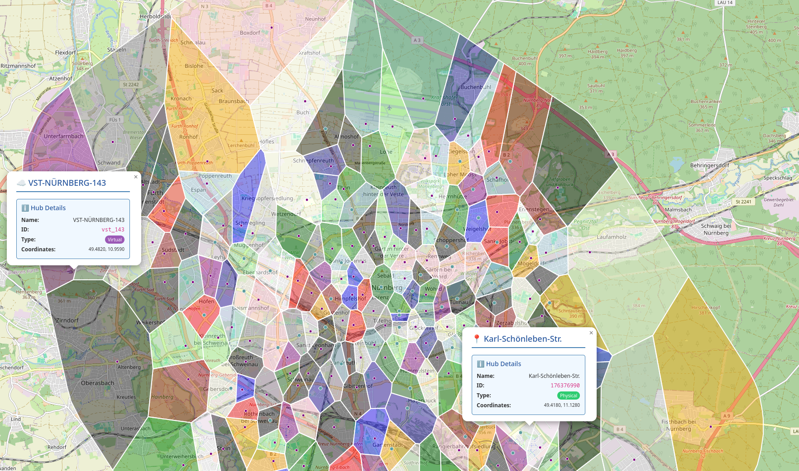

# Virtual Station Discovery & Classifier for Micromobility Networks

A tool for discovering virtual stations and classifying micromobility locations across different network types (Station-based, Free-floating, or Mixed).

## Introduction

This pipeline automates the process of identifying optimal "virtual stations" for free-floating micromobility data and maps locations to either existing physical stations or these new virtual ones. It handles network type detection and automated data extraction from nextbike datasets.



## Installation

### Option 1: Local Installation (Recommended for development)

1. **Clone the repository:**
   ```bash
   git clone git@github.com:PhD-Kerger/virtual-micromobility-station-classifier.git
   cd virtual-micromobility-station-classifier
   ```
2. **Set up a virtual environment:**
   ```bash
   python -m venv .venv
   source .venv/bin/activate  # On Linux/macOS
   # OR
   .venv\Scripts\activate     # On Windows
   ```
3. **Install dependencies:**
   ```bash
   pip install -r requirements.txt
   ```
4. **Configure environment:**
   Create an `env.yaml` in the root directory and specify your data paths:
   ```yaml
   # Data paths configuration
   data_paths:
     availability: "/path/to/availability/folder/"
     geo: "/path/to/geo_information.parquet"
     station_names: "/path/to/station_names.parquet"
   ```

### Option 2: Docker Installation

1. **Build the image:**
   ```bash
   docker build -t micromobility-station-classifier .
   ```
2. **Run a command via Docker:**
   ```bash
   docker run -v $(pwd)/data:/app/data micromobility-station-classifier info --city "Berlin"
   ```

## Usage

> **Note:** This project requires availability data in a specific Parquet format. If you have raw GBFS or Nextbike files and need to generate these Parquet files, please refer to the [Data Pipelines](https://github.com/PhD-Kerger/data-pipelines) repository.

The CLI supports three main commands: `info`, `train`, and `classify`.

### Global Arguments

Every command requires the `--city` argument, which corresponds to the network name in the dataset (e.g., "Berlin", "Mannheim").

---

### 1. Automated Pipeline (Recommended)

Use the `info` command to automatically detect the network type, extract data, train the model, and classify locations for a specific city.

**Command:**

```bash
python main.py info --city "berlin" [options]
```

**Arguments:**
| Argument | Description | Default |
|----------|-------------|---------|
| `--city` | **(Required)** Name of the city/network. | - |
| `--max-files` | Max files to process for automated detection and extraction. | `50` |

---

### 2. Manual Training

Train a model using specific location files or JSON strings. If files are omitted, it will attempt automated extraction.

**Command:**

```bash
python main.py train --city "berlin" [options]
```

**Arguments:**
| Argument | Description | Default |
|----------|-------------|---------|
| `--city` | **(Required)** Name of the city. | - |
| `--locations` | JSON string of points: `'[[lat, lng], ...]'`. | - |
| `--locations-file` | Path to a JSON file containing location coordinates. | - |
| `--existing-stations-file` | Path to JSON for physical stations: `[{'latitude': lat, ...}]`. | - |
| `--bandwidth` | MeanShift clustering bandwidth (influences virtual station density). | `0.004` |
| `--max-files` | Max files to process for automated virtual station extraction. | `30` |

---

### 3. Classification

Classify new locations based on an existing city model.

**Command:**

```bash
python main.py classify --city "berlin" [options]
```

**Arguments:**
| Argument | Description | Default |
|----------|-------------|---------|
| `--city` | **(Required)** Name of the city. | - |
| `--locations` | JSON string of points to classify. | - |
| `--locations-file` | Path to JSON file of coordinates to classify. | - |
| `--max-files` | Max files to process for automated classification data. | `30` |

---

## Data Format

The pipeline expects bike-sharing availability data in **Parquet** format. This data is used for automated network type detection and virtual station discovery.

### Required Schema

The Parquet files should contain the following columns:

| Column            | Type             | Description                                   |
| ----------------- | ---------------- | --------------------------------------------- |
| `location_id`     | `int32`          | Unique identifier for the location.           |
| `timestamp`       | `datetime (UTC)` | Timestamp of the availability record.         |
| `network_name`    | `string`         | The city or network name (e.g., "Berlin").    |
| `station_name_id` | `int32`          | Identifier for the station name.              |
| `station_id`      | `string`         | The ID of the station.                        |
| `n_vehicles`      | `int16`          | Number of vehicles available at the location. |

### Required Metadata Files

The pipeline joins the availability data with these metadata files to resolve names and coordinates:

#### 1. Geo Information (`geo_information.parquet`)

**Path:** `data/extensions/geo/geo_information.parquet`  
Used to map `location_id` to spatial coordinates.

| Column        | Type               | Description                                |
| ------------- | ------------------ | ------------------------------------------ |
| `location_id` | `int64`            | Primary key for joining with availability. |
| `location`    | `string (WKT/WKB)` | Spatial coordinates (Point).               |

#### 2. Station Names (`station_names.parquet`)

**Path:** `data/metadata/station_names.parquet`  
Used to map `station_name_id` to human-readable names.

| Column            | Type     | Description                        |
| ----------------- | -------- | ---------------------------------- |
| `station_name_id` | `int64`  | Key for joining with availability. |
| `station_name`    | `string` | The display name of the station.   |

---

## Utility Scripts

The utility scripts in `utils/` can be used standalone for specific tasks:

- **`utils/get_free_floating.py`**: Robustly classifies a network as Station-based, Free-floating, or Mixed by analyzing vehicle distribution.
- **`utils/train_helper.py`**: Standalone extraction of training locations and existing stations for a city.
- **`utils/classify_helper.py`**: Standalone extraction of locations for classification.

Example standalone usage:

```bash
python utils/get_free_floating.py --network "Berlin"
python utils/train_helper.py "Berlin"
```

Keep in mind that these scripts are designed to be used within the main pipeline for best results, as they rely on the same data extraction logic. When used standalone, ensure that the paths in the scripts are correctly updated to point to your data.

## Output

Results are saved in the `data/<city_name>/` directory:

- `kdtree.pkl`: The trained spatial model.
- `voronoi.html`: Interactive map of the hubs and their catchment areas.
- `classified_locations.csv`: Mapping of input points to station IDs, names, and types (virtual vs. existing).
- `locations_train.txt` & `locations_classify.txt`: Intermediate extracted coordinates.
- `existing_stations.json`: Extracted Metadata for physical stations.
